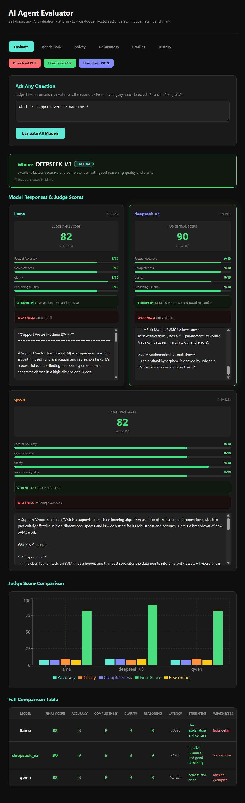

# AI Hallucination Evaluation and Reliability Analysis Framework 

## Dashboard Preview

The framework provides an interactive evaluation dashboard for comparing model responses, inspecting judge scores, and analyzing hallucination indicators.



## Problem Statement

Large Language Models often generate responses that appear convincing while containing incorrect, unsupported, or fabricated information. This phenomenon, known as hallucination, remains a major challenge for deploying AI systems in domains that require reliability and trust.

This project explores automated methods for evaluating response quality, detecting potential hallucinations, comparing multiple language models, and analyzing model behavior through quantitative and qualitative metrics.

The objective is to provide a practical framework for studying model reliability rather than relying solely on subjective human evaluation.

## Overview

...
Large Language Models (LLMs) are capable of producing fluent and contextually relevant responses across a wide range of tasks. However, they may also generate factually incorrect, unsupported, or fabricated information while maintaining a high degree of linguistic confidence. This phenomenon, commonly referred to as *hallucination*, remains one of the primary barriers to deploying LLMs in high-trust environments.

This project presents an experimental framework for evaluating the reliability of LLM-generated responses through a combination of reference-based scoring, semantic similarity analysis, hallucination assessment, and model benchmarking.

The framework was developed to investigate a fundamental question:

> How can we systematically measure whether an LLM response should be trusted?

Rather than relying on a single evaluation metric, the system combines multiple quantitative and qualitative evaluation strategies to provide a more comprehensive assessment of model behavior.

---

## Motivation

Current evaluation methods often focus on lexical overlap metrics such as BLEU and ROUGE. While useful, these metrics do not adequately capture factual correctness, reasoning quality, or semantic faithfulness.

Modern language models frequently generate responses that appear plausible but contain inaccurate information. Detecting such failures remains a challenging research problem.

This project explores methods for:

* Evaluating response quality across multiple dimensions.
* Identifying potential hallucinations through external reference comparison.
* Benchmarking multiple language models under identical conditions.
* Tracking model reliability over time.
* Building a foundation for future agent reliability and safety evaluation systems.

---

## Research Objectives

The project investigates several practical and research-oriented questions:

1. Can semantic similarity metrics be used to estimate factual consistency?

2. How frequently do different language models hallucinate under identical prompts?

3. Can model-specific performance profiles be constructed using historical benchmark data?

4. To what extent does agreement between multiple models correlate with response reliability?

5. Can automated evaluation frameworks reduce the need for manual assessment of model outputs?

---

## System Architecture

The framework is organized into four major layers.

### 1. Model Execution Layer

Responsible for querying one or more language models and collecting generated responses.

Current implementation supports multiple model providers through a unified interface, allowing direct comparison between model outputs.

### 2. Evaluation Layer

Computes response quality metrics using both lexical and semantic approaches.

Implemented metrics include:

* Exact Match
* BLEU Score
* ROUGE Score
* Semantic Similarity
* Keyword Overlap
* Composite Evaluation Score

These metrics provide complementary perspectives on response quality.

### 3. Hallucination Analysis Layer

Evaluates factual consistency by comparing generated responses against external reference information.

The workflow consists of:

1. Retrieving reference information.
2. Comparing model output with retrieved evidence.
3. Measuring semantic alignment.
4. Estimating hallucination likelihood.
5. Producing an interpretable hallucination assessment.

### 4. Benchmarking and Analytics Layer

Maintains historical records of model performance and evaluation outcomes.

Capabilities include:

* Benchmark execution
* Historical result tracking
* Category-specific performance analysis
* Model ranking
* Failure pattern identification

---

## Methodology

### Response Evaluation

Generated responses are compared against reference answers using a combination of lexical and semantic metrics.

The objective is not to optimize for a single score but rather to obtain a balanced view of response quality.

### Hallucination Detection

The hallucination analysis pipeline compares generated responses with external reference material and computes:

* Semantic Alignment
* Keyword Consistency
* Hallucination Score
* Final Verification Verdict

### LLM-as-a-Judge Evaluation

A secondary evaluation mechanism assesses responses using higher-level criteria such as:

* Factual Accuracy
* Completeness
* Clarity
* Reasoning Quality

These dimensions are aggregated into a final evaluation score.

### Performance Profiling

Evaluation results are stored and aggregated to construct model performance profiles across different prompt categories.

This enables long-term comparison of model strengths and weaknesses.

---

## Database Design

The current system maintains structured records for:

### Evaluations

Stores response quality metrics and overall evaluation scores.

### Hallucination Tests

Stores reference information, hallucination assessments, and verification results.

### Judge Evaluations

Stores qualitative scoring dimensions and model rankings.

### Benchmark Runs

Stores benchmark metadata and aggregated benchmark results.

### Failure Patterns

Stores detected failure cases and observed reliability issues.

The database design supports future migration from SQLite to PostgreSQL without significant architectural changes.

---

## Repository Structure

```text
ai-hallucination-detector/

├── app/
│   ├── main.py
│   ├── evaluator.py
│   ├── llm_client.py
│   ├── database.py
│   └── __init__.py
│
├── frontend/
│   ├── src/
│   ├── public/
│   └── package.json
│
├── requirements.txt
├── start.bat
└── README.md
```

---

## Installation

### Backend

Create a virtual environment:

```bash
python -m venv venv
```

Activate the environment:

```bash
venv\Scripts\activate
```

Install dependencies:

```bash
pip install -r requirements.txt
```

Create a `.env` file:

```env
HF_API_TOKEN=YOUR_TOKEN
```

Start the backend server:

```bash
uvicorn app.main:app --reload
```

---

### Frontend

Install frontend dependencies:

```bash
cd frontend
npm install
```

Run the frontend:

```bash
npm run dev
```

---

## Current Limitations

The current implementation serves as an experimental evaluation platform and has several limitations.

* Semantic agreement does not guarantee factual correctness.
* Retrieved references may contain incomplete information.
* LLM-based evaluation can introduce evaluator bias.
* Hallucination detection remains probabilistic rather than deterministic.
* Domain-specific verification has not yet been fully explored.

These limitations motivate future work on retrieval-grounded verification and multi-model consensus systems.

---

## Future Work

Planned extensions include:

### Evaluation

* Adversarial prompt testing
* Safety benchmarking
* Robustness evaluation
* Confidence calibration

### Infrastructure

* PostgreSQL migration
* SQLAlchemy integration
* Automated report generation
* Docker deployment

### Reliability Research

* Multi-model verification pipelines
* Consensus-based answer synthesis
* Agent reliability scoring
* Self-improving evaluation systems

### Benchmarking

* Standardized benchmark datasets
* Statistical significance analysis
* Longitudinal performance tracking
* Failure taxonomy development

---

## References

Papineni, K., Roukos, S., Ward, T., & Zhu, W. (2002)

**BLEU: A Method for Automatic Evaluation of Machine Translation**

---

Lin, C. Y. (2004)

**ROUGE: A Package for Automatic Evaluation of Summaries**

---

Zheng, L. et al. (2023)

**Judging LLM-as-a-Judge with MT-Bench and Chatbot Arena**

---

Huang, L. et al. (2025)

**A Survey on Hallucination in Large Language Models**

---

## Author

**Prateek Dhamangave**

B.Tech – Artificial Intelligence and Data Science

This repository is an ongoing exploration of reliability, evaluation, and trustworthiness in large language model systems.
