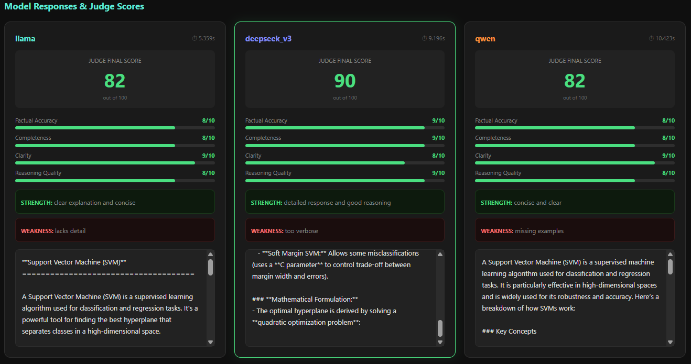
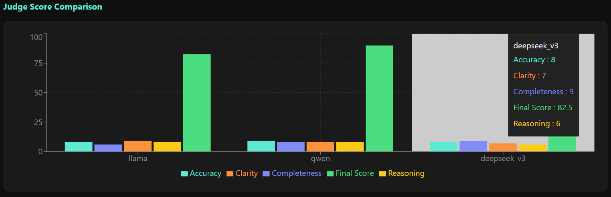
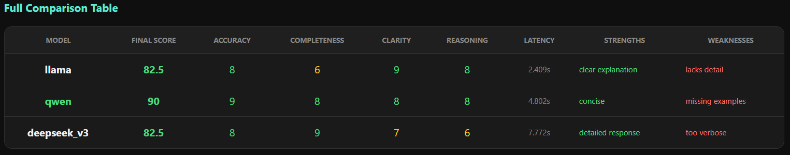
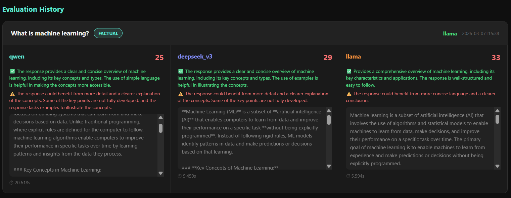
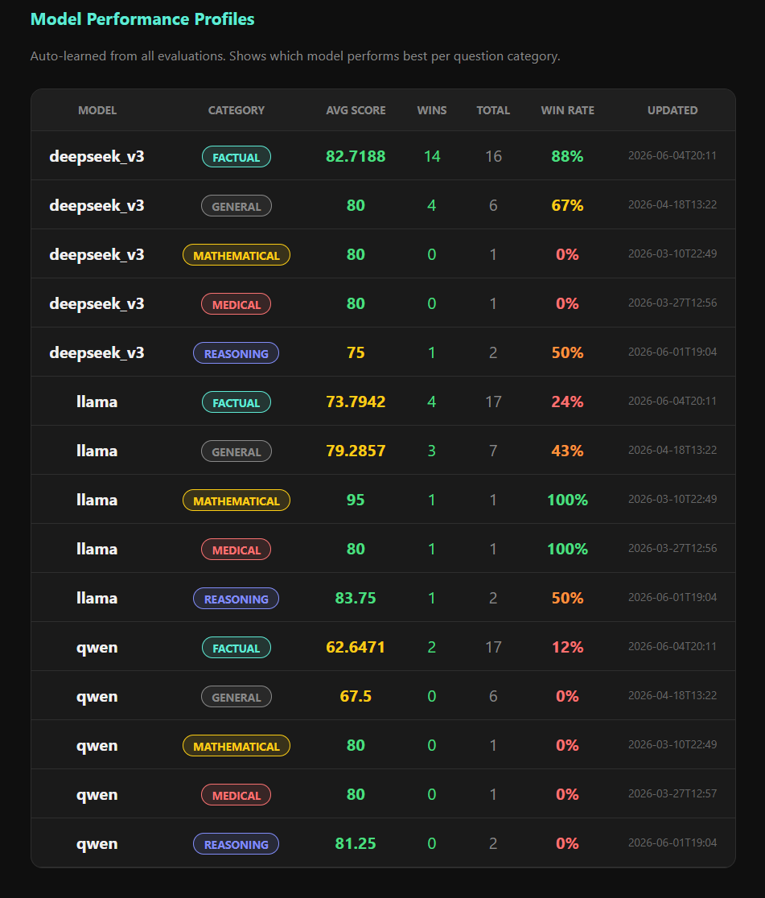

# AI Hallucination Evaluation and Reliability Analysis Framework

## Overview

Large Language Models (LLMs) have demonstrated remarkable capabilities across reasoning, question answering, summarization, code generation, and conversational AI. Despite these advances, hallucinated outputs—responses that are factually incorrect, unsupported by evidence, or entirely fabricated—remain one of the most significant barriers to deploying LLMs in reliability-critical environments.

This project presents an experimental framework for evaluating the reliability and trustworthiness of LLM-generated responses through a combination of lexical evaluation metrics, semantic similarity analysis, hallucination assessment, benchmarking workflows, and LLM-as-a-Judge evaluation.

The framework was developed to investigate a fundamental research question:

> How can we systematically evaluate whether an LLM-generated response should be trusted?

Rather than relying on a single metric, the system combines multiple complementary evaluation strategies to provide a more comprehensive view of response quality, factual consistency, and model reliability.

---

## Dashboard Preview

The framework provides an interactive dashboard for evaluating, benchmarking, and comparing responses from multiple language models.

### Model Evaluation Dashboard


---

## Key Dashboard Components

### Model Evaluation 

The model evaluation module compares generated responses against reference answers using lexical and semantic evaluation metrics.



### Judge Score Comparison 

The LLM-as-a-Judge module evaluates responses across factual accuracy, completeness, clarity, and reasoning quality.



### Benchmark Results

The benchmarking module compares multiple language models on identical prompts and ranks them using quantitative metrics and LLM-as-a-Judge scores.



### Evaluation History

All evaluation runs are stored for longitudinal analysis, enabling comparison of model behavior across prompts, benchmark runs, and evaluation sessions.



### Model Performance Profiles

The framework maintains historical performance profiles for each model across prompt categories. These profiles track average scores, win rates, and evaluation statistics over time.



## Key Features

### Multi-Model Evaluation

Evaluate and compare responses generated by multiple language models under identical prompts and evaluation criteria.

### Hallucination Analysis

Assess factual consistency by comparing generated responses against external reference information and measuring semantic alignment.

### LLM-as-a-Judge Scoring

Automatically evaluate responses using higher-level dimensions such as:

* Factual Accuracy
* Completeness
* Clarity
* Reasoning Quality

### Benchmark Execution

Run benchmark datasets across multiple models and compare performance using standardized evaluation metrics.

### Historical Analytics

Store evaluation results and benchmark outcomes for long-term performance analysis and trend monitoring.

### Failure Pattern Tracking

Identify recurring weaknesses and failure modes across different prompt categories and models.

---

## Research Objectives

This project investigates several practical and research-oriented questions:

1. Can semantic similarity metrics be used to estimate factual consistency?

2. How frequently do different language models hallucinate under identical evaluation conditions?

3. Can model-specific reliability profiles be constructed using historical benchmark data?

4. Does agreement between multiple models correlate with response reliability?

5. Can automated evaluation systems reduce dependence on manual assessment of LLM outputs?

---

## System Architecture

The framework follows a multi-stage evaluation pipeline:

```text
User Query
    │
    ▼
Multi-Model Inference Layer
(Llama / DeepSeek / Qwen)
    │
    ▼
Response Collection
    │
    ▼
Evaluation Engine
├── BLEU Score
├── ROUGE Score
├── Semantic Similarity
├── Keyword Overlap
└── Composite Score
    │
    ▼
Hallucination Analysis
├── Reference Comparison
├── Evidence Alignment
├── Consistency Verification
└── Risk Assessment
    │
    ▼
LLM-as-a-Judge Evaluation
├── Accuracy
├── Completeness
├── Clarity
└── Reasoning Quality
    │
    ▼
Database Storage
    │
    ▼
Analytics Dashboard
```

---

## Evaluation Methodology

The framework evaluates model responses using multiple complementary metrics rather than relying on a single score.

### Lexical Metrics

#### BLEU Score

Measures n-gram overlap between generated and reference responses.

#### ROUGE Score

Measures recall-oriented overlap and content coverage.

### Semantic Metrics

#### Semantic Similarity

Computes embedding-based similarity between generated responses and reference answers to capture meaning beyond exact wording.

#### Keyword Overlap

Measures preservation of important concepts and entities.

### Hallucination Assessment

The hallucination analysis pipeline estimates factual reliability through:

* Reference retrieval
* Semantic alignment analysis
* Evidence consistency checks
* Hallucination risk estimation

### LLM-as-a-Judge Evaluation

A judge model evaluates responses across four dimensions:

| Dimension    | Description                                 |
| ------------ | ------------------------------------------- |
| Accuracy     | Factual correctness                         |
| Completeness | Coverage of relevant information            |
| Clarity      | Readability and communication quality       |
| Reasoning    | Logical consistency and explanation quality |

The individual scores are aggregated into a final evaluation score used for ranking and benchmarking.

---

## Experimental Results

The framework supports comparative evaluation of multiple language models under identical conditions.

### Example Benchmark Results

| Model       | Final Score | Accuracy | Completeness | Clarity | Reasoning |
| ----------- | ----------- | -------- | ------------ | ------- | --------- |
| DeepSeek V3 | 90          | 9        | 9            | 8       | 9         |
| Llama       | 82          | 8        | 8            | 9       | 8         |
| Qwen        | 82          | 8        | 8            | 9       | 8         |

### Observations

* DeepSeek V3 consistently achieved the highest overall evaluation scores during initial experiments.
* Llama generated concise and readable responses but occasionally lacked depth.
* Qwen demonstrated strong clarity while sometimes omitting supporting details.
* Higher semantic similarity often correlated with stronger judge scores.
* Multi-model agreement appeared to be a useful indicator of response reliability.

---

## Database Design

The current implementation maintains structured records for:

### Evaluations

Stores response quality metrics and overall evaluation scores.

### Hallucination Tests

Stores reference information, semantic alignment scores, hallucination assessments, and verification outcomes.

### Judge Evaluations

Stores qualitative scoring dimensions and ranking information.

### Benchmark Runs

Stores benchmark metadata and aggregated benchmark results.

### Failure Patterns

Stores observed reliability failures and categorized model weaknesses.

The current implementation uses SQLite and is designed to support future migration to PostgreSQL with minimal architectural changes.

---

## Technology Stack

### Backend

* Python
* FastAPI

### Frontend

* React
* Vite

### Database

* SQLite

### NLP & Evaluation

* Sentence Transformers
* BLEU
* ROUGE

### Model Evaluation

* LLM-as-a-Judge Evaluation
* Semantic Similarity Analysis
* Hallucination Assessment

### Visualization

* Recharts
* Interactive Analytics Dashboard

---

## Repository Structure

```text
ai-hallucination-detector/

├── app/
│   ├── main.py
│   ├── evaluator.py
│   ├── llm_client.py
│   ├── database.py
│   └── __init__.py
│
├── frontend/
│   ├── src/
│   ├── public/
│   └── package.json
│
├── screenshots/
│   └── evaluation-dashboard.png
│
├── requirements.txt
├── start.bat
└── README.md
```

---

## Installation

### Backend Setup

Create a virtual environment:

```bash
python -m venv venv
```

Activate the environment:

```bash
venv\Scripts\activate
```

Install dependencies:

```bash
pip install -r requirements.txt
```

Create a `.env` file:

```env
HF_API_TOKEN=YOUR_TOKEN
```

Run the backend:

```bash
uvicorn app.main:app --reload
```

---

### Frontend Setup

```bash
cd frontend
npm install
npm run dev
```

Open:

```text
http://localhost:5173
```

---

## Current Limitations

The framework should be interpreted as an evaluation and decision-support system rather than a definitive measure of factual correctness.

Current limitations include:

* Semantic similarity does not guarantee factual accuracy.
* Hallucination detection remains probabilistic.
* Reference quality directly affects evaluation quality.
* Judge models may introduce evaluator bias.
* Domain-specific verification workflows remain limited.

---

## Future Work

### Hallucination Research

* Retrieval-Augmented Verification
* Multi-source evidence validation
* Claim-level fact verification
* Citation-grounded evaluation
* Confidence calibration analysis

### Multi-Model Verification

* Consensus-based answer validation
* Majority-vote verification
* Debate-based evaluation
* Cross-model critique pipelines
* Ensemble reliability scoring

### Infrastructure

* PostgreSQL migration
* SQLAlchemy integration
* Docker deployment
* Automated PDF report generation
* CI/CD pipelines

### Safety and Robustness

* Adversarial prompt testing
* Prompt injection resistance
* Jailbreak evaluation
* Safety benchmarking
* Agent reliability assessment

### Self-Improving Evaluation Systems

* Failure pattern discovery
* Dynamic benchmark generation
* Automated evaluator refinement
* Reliability trend forecasting

---

## References

Papineni, K., Roukos, S., Ward, T., & Zhu, W. (2002)

**BLEU: A Method for Automatic Evaluation of Machine Translation**

---

Lin, C. Y. (2004)

**ROUGE: A Package for Automatic Evaluation of Summaries**

---

Zheng, L. et al. (2023)

**Judging LLM-as-a-Judge with MT-Bench and Chatbot Arena**

---

Huang, L. et al. (2025)

**A Survey on Hallucination in Large Language Models**

---

## Author

**Prateek Dhamangave**

B.Tech — Artificial Intelligence and Data Science

This repository represents an ongoing exploration of reliability, evaluation methodologies, and trustworthiness in large language model systems, with a focus on hallucination analysis, automated benchmarking, and model reliability assessment.
